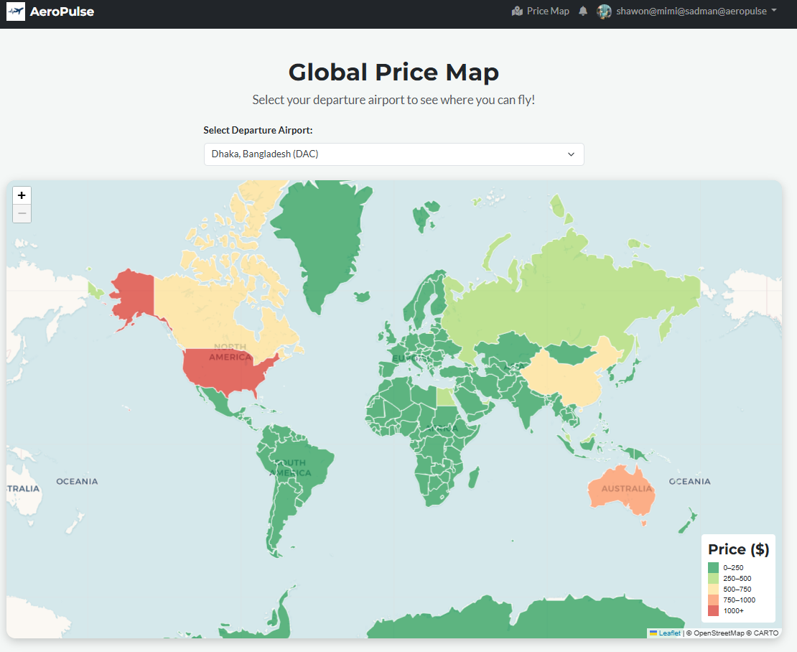
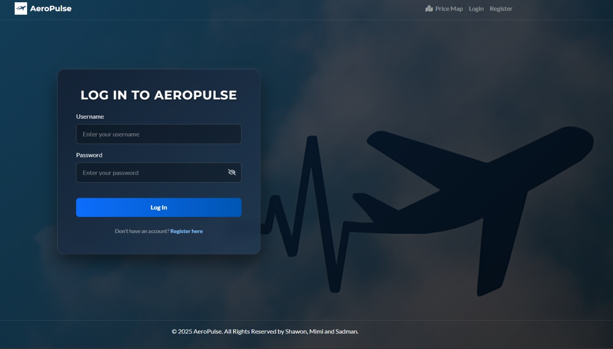
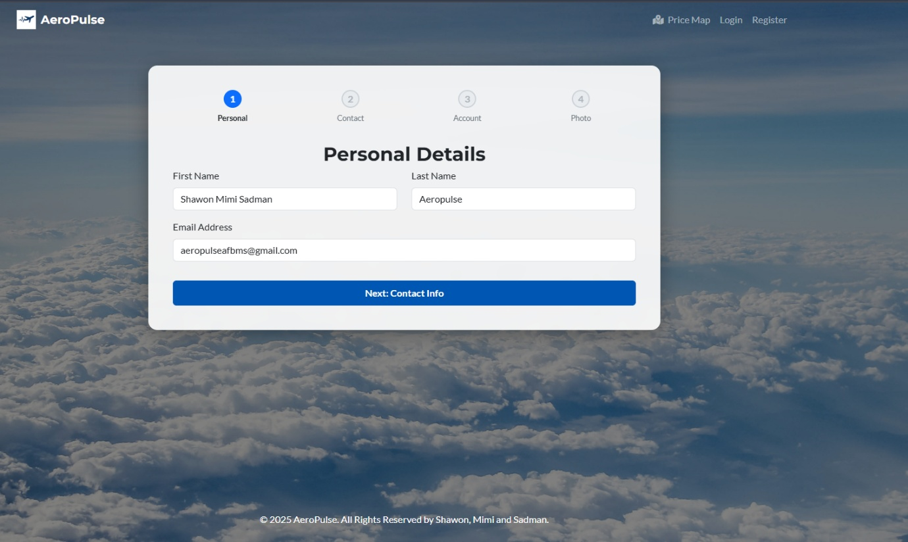
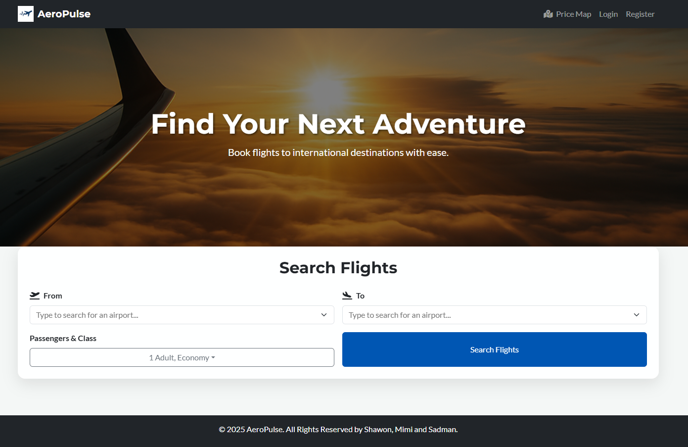
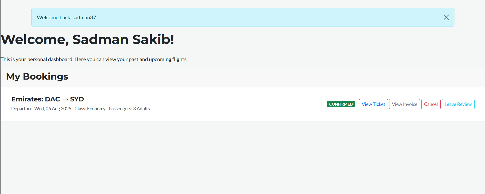
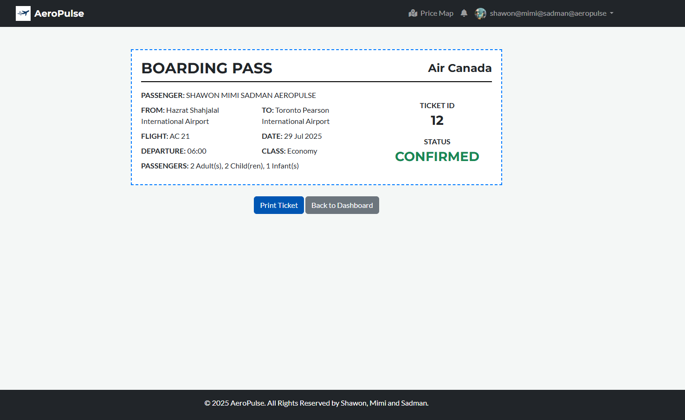
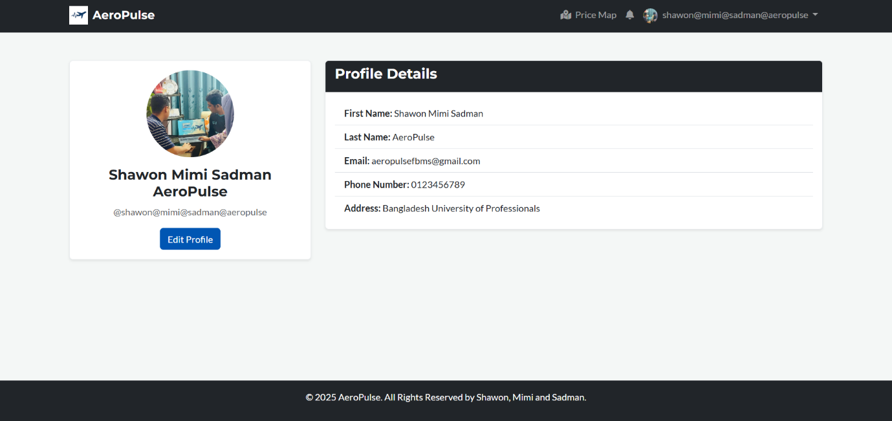

# AeroPulse: A Modern Flight Booking & Management System


AeroPulse is a full-stack flight booking and management web application built from the ground up to provide a seamless, elegant, and dynamic user experience. It goes beyond standard booking systems by integrating unique, data-driven features that turn travel planning into an experience of discovery.

This project demonstrates a comprehensive understanding of modern web development principles, 3NF database design, and user-centric feature implementation.

---


## ✨ Key Features & Modules

AeroPulse is built around three core user roles, each with a tailored set of features.

### 👤 For Passengers (The User Benefit Interface)

*   **Elegant Multi-Step Onboarding:** A guided, 4-step registration wizard for a smooth signup experience, collecting personal, contact, and profile information, including a photo upload.
*   **Advanced Flight Search:** An intuitive interface to find flights based on route, number of passengers (Adults, Children, Infants), and travel class (Economy/Business), featuring searchable airport dropdowns.
*   **Personalized Dashboard:** A central hub for registered users to view their complete booking history, check flight statuses (Pending, Confirmed, Cancelled), and access key actions.
*   **Complete Booking Lifecycle:** A seamless end-to-end booking flow, from a detailed fare confirmation page to a simulated payment gateway, with automated generation of printable **e-tickets** and **invoices**.
*   **Full Profile Management:** Users can view and update all their personal details—including their name, contact info, address, gender, and profile photo—from a dedicated profile page.
*   **Easy Cancellations & Reviews:** Passengers can cancel confirmed bookings and leave post-flight reviews (rating and comment), contributing to a community-driven experience.
*   **Live Notifications:** A real-time notification system in the navbar keeps users informed of important updates.

### 🌟 The Unique Features Showcase

What truly sets AeroPulse apart is its focus on travel discovery.

#### The Global Price Map
Turn flight booking into an adventure. This interactive world map allows users to select a departure airport and instantly see a "heatmap" of global travel affordability, with countries color-coded by the cheapest available flight price. It’s a powerful data visualization tool that answers the question: "Where in the world can I afford to go?"

<p align="center">
  
</p>

### 🛠️ For Administrators

*   **Comprehensive Backend Control:** A secure and powerful backend powered by the Django Admin Panel.
*   **Full CRUD Functionality:** Administrators have complete Create, Read, Update, and Delete control over all core data, including **Flights** (with separate pricing/seating for Economy and Business), **Airlines**, and **Airports**.
*   **System Oversight:** Admins can view all user bookings, manage passenger accounts, moderate reviews, and send notifications.

---

## 🗄️ Database Schema (ER Diagram)

The database was designed from a conceptual E-R Diagram to a relational schema, ensuring adherence to **Third Normal Form (3NF)**. This robust design guarantees data integrity, eliminates redundancy, and provides a scalable foundation for the application.

A single, deliberate exception to 3NF is the `total_fare` field in the `Booking` table. This is a standard denormalization practice to "snapshot" the price at the time of transaction and significantly improve query performance.

<p align="center">
  
</p>
---

## 📸 Application Screenshots

| Login Page (Glassmorphism UI) | Registration Wizard (with Progress Bar) |
| :---: | :---: |
|  |  |
| **Homepage Search** | **Passenger Dashboard** |
|  |  |
| **Printable E-Ticket** | **User Profile Page** |
|  |  |

---

## 🚀 Setup and Installation

To run this project on your local machine, please follow these steps:

### 1. Prerequisites
*   Python (3.10 or higher recommended)
*   MySQL Server
*   Git

### 2. Clone the Repository
```bash
git clone https://github.com/your-username/AeroPulse.git
cd AeroPulse
